# AIOps 智能运维托管平台

[](https://github.com/xkqs1280/AIOps-Platform/releases)
[](LICENSE)

面向网络与安全设备的 7×24 智能监控与运维平台。单机一体化部署，支持设备台账、实时监控、智能告警、网络拓扑、配置备份、合规巡检、安全态势、AI 辅助运维、移动 APP 与一键升级。

设备一多，靠人盯班就是一场灾难：告警刷屏看不过来、配置改动没记录、巡检报告熬夜手写、故障定位全凭经验。AIOps 平台专门解决这些问题——一套系统管住「看得见、报得准、查得快、备得上」。以下全部为平台真实运行界面截图（v4.5.2）。

## 平台预览

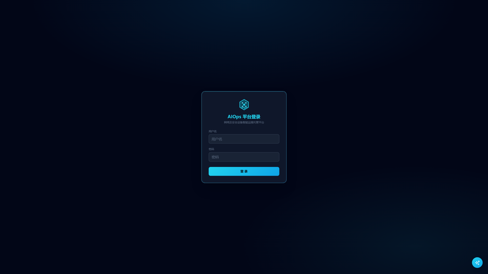

### 01 监控大屏：全网健康，一屏尽览

设备健康概览、类型/厂商分布、CPU / 内存 / 带宽 TOP 排行、实时告警滚动、设备生命周期提醒，全部集中在一块大屏。值班室投一块屏，全网状态尽在掌握。

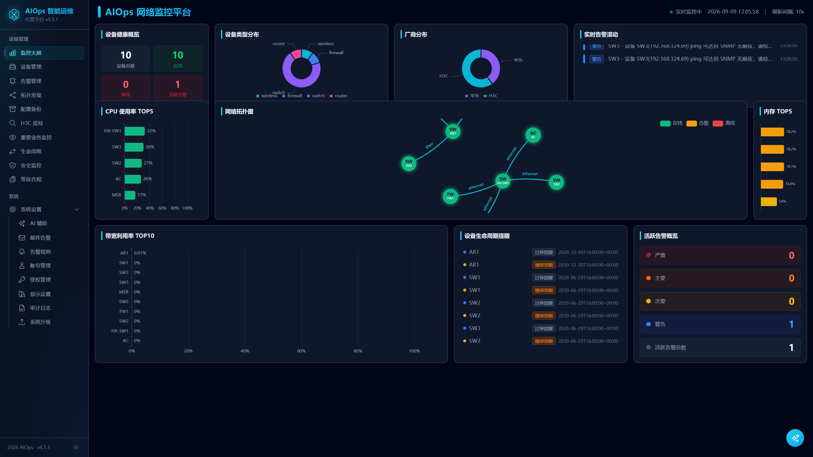

### 02 设备管理：300 台规模，多厂商统一纳管

支持华为、H3C 等主流厂商的交换机、路由器、防火墙、无线控制器统一管理，状态灯直观展示在线/告警/离线，CPU、内存使用率实时刷新，支持批量导入导出与一键同步。

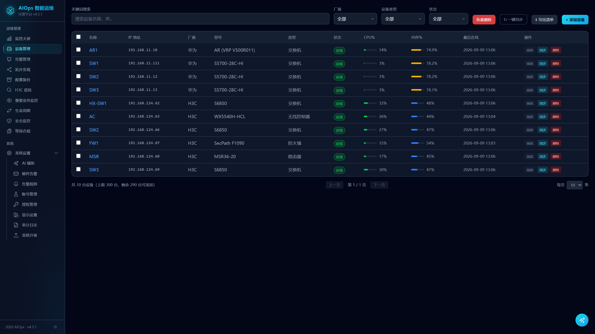

### 03 拓扑发现：链路状态与负载，一眼看清

自动发现网络拓扑，链路按带宽利用率着色（低/中/高），红色链路即拥塞热点；支持自定义链路维护，物理结构与业务流量一目了然。

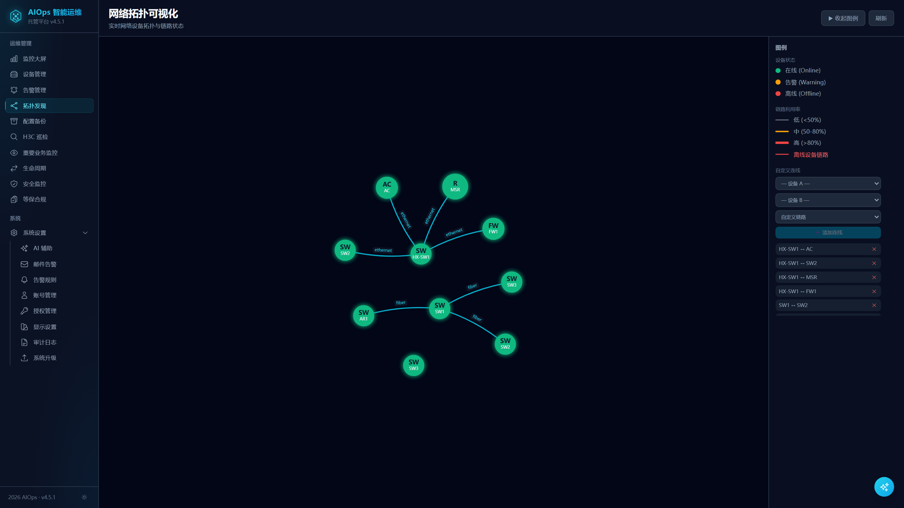

### 04 告警管理：报得准，还能压得住

分级告警（严重/主要/次要/警告）+ 告警规则自定义 + 告警压制窗口，避免风暴式刷屏；SNMP 采集异常与离线告警统一携带 5 分钟防抖，间歇性恢复设备不再产生噪声。支持邮件告警通知，故障发生第一时间触达值班人。

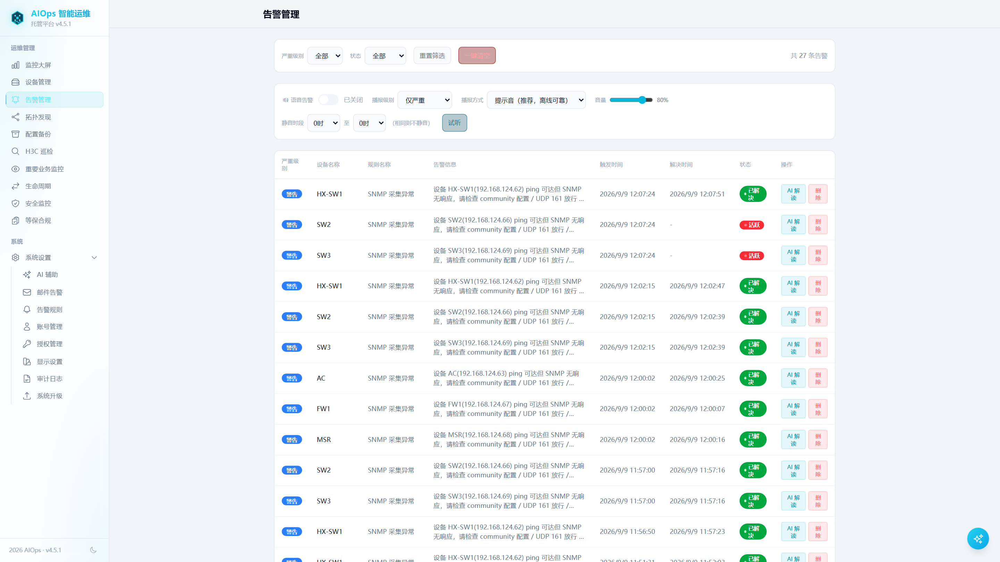

### 05 H3C 设备巡检：告别熬夜写报告

批量下发巡检任务，自动采集设备运行数据并逐台分析，一键导出 Word / Excel 巡检报告。原来半天的人工巡检，现在几分钟自动完成。

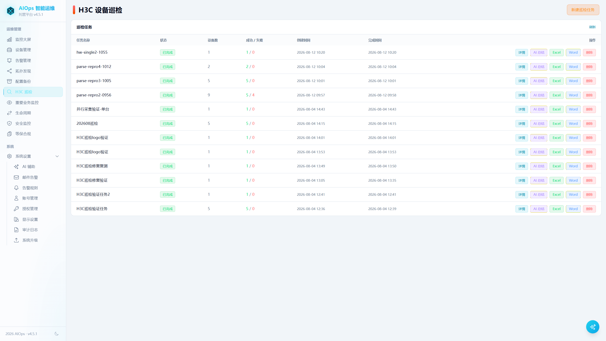

### 06 重要业务监控：终端级探活（v4.5.1 升级）

对重要业务终端进行分组探活监控，掉线秒级发现，业务连续性有保障。新装部署自动创建「默认分组」，无需先手动建组即可添加终端；终端/告警双 Tab + 分组筛选 + 30s 自动轮询。**移动端 APP 已同步上线同名模块**（登录后「更多」入口）。

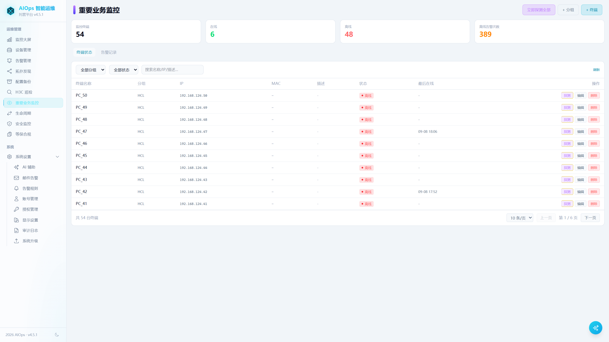

### 07 安全监控：外部威胁态势感知

集成 FreeIOC 开放威胁情报（恶意软件 IP/CC/僵尸网络），自动比对设备日志，外部动态威胁一目了然，高危来源立即曝光。

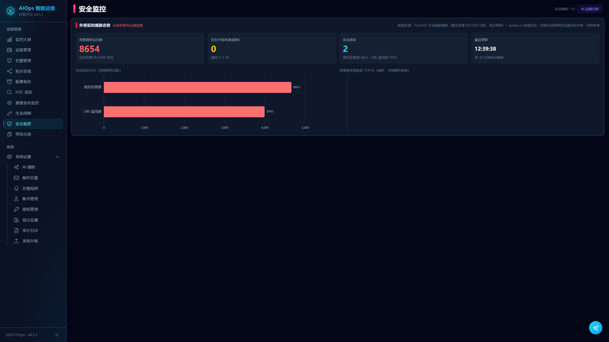

### 08 配置备份：改了什么，随时可回溯

设备配置定时/手动备份，配置变化留痕，故障时可随时回滚比对——「谁改了配置」不再是悬案。变更审计与版本对比一站完成。

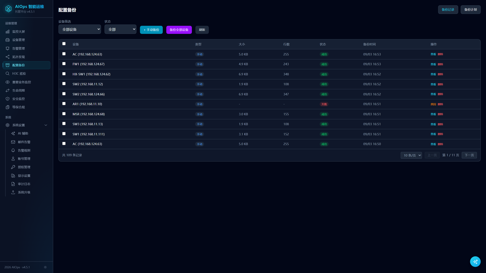

### 09 AI 辅助运维：接入大模型，告警有人解读、报告有人代写

OpenAI 兼容协议一键接入（Ollama 本地 / 内网网关 / 云端 API 均可），告警 AI 解读、巡检 AI 总结、AI 运维日报（领导汇报版）、CLI 命令助手、全局悬浮助手六大场景；内置 RAG 知识库（向量 + 关键词混合检索），运维经验文档上传即可被检索引用。SSE 流式输出、结果缓存 24h、API Key 加密存储、敏感凭据自动脱敏——设备密码与 SNMP 团体字永不进入 AI prompt。

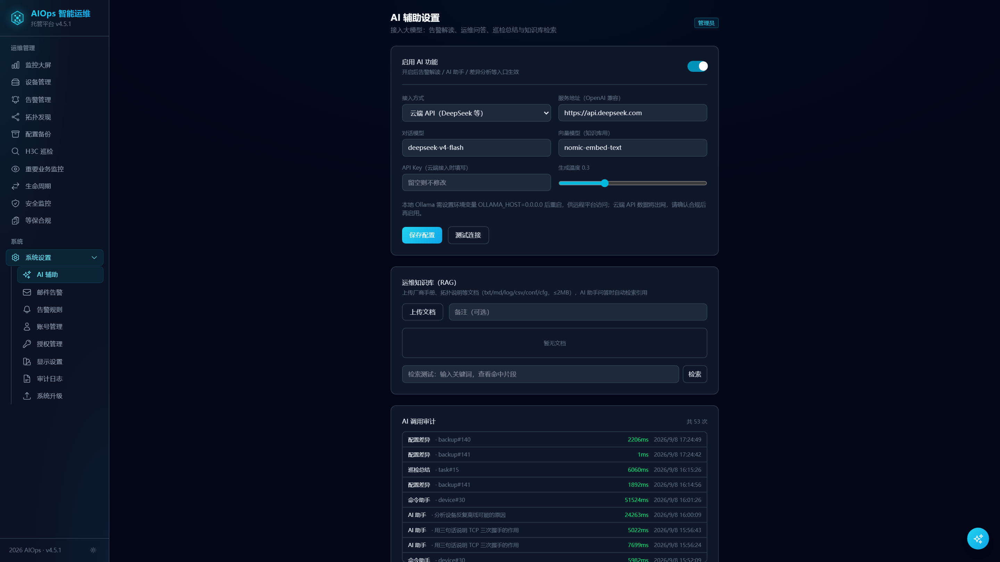

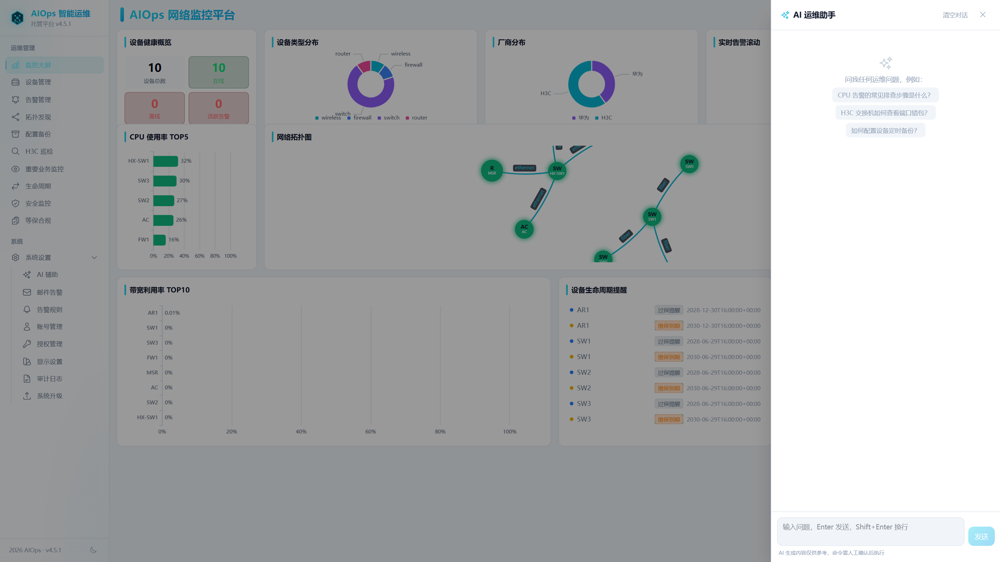

### 10 设备 CLI 命令行终端

浏览器里直连设备（SSH/Telnet），兼容 H3C Comware / 华为 VRP 老设备与 GBK 中文，会话全程审计留痕。

### 11 等保合规 · 安全基线 · 设备生命周期 · 审计日志

等保 2.0 三级核查项 + 自动评分 + 报告导出；**配置基线核查**：对设备配置文本做结构化比对（14 条 CFG-* 规则覆盖身份鉴别/访问控制/安全审计/入侵防范/数据保密性五维），与运行态 SSH 核查结果合并评分，证据自动打码、绝不落配置原文；设备续保/维保自动提醒；平台操作全程审计留痕。

### 12 移动端 Android APP（v4.5.1 同步）

随时查看设备、告警、业务监控、等保合规、安全态势、生命周期、设备巡检；启动屏与桌面图标统一品牌 logo（深青背景 + 居中平台 logo）；30 秒轮询 + 系统通知推送。

## v4.5.2 更新要点

- 🛡 **等保合规 · 配置基线核查**：新增配置态核查引擎，直接读最近一次配置备份做结构化比对（14 条 `CFG-*` 规则、五维分类），与运行态 SSH 核查**合并出分**；未采集配置的项标"未核查"而非判不合规；证据只存「行号 + 打码片段」，明文口令绝不落库
- 🔧 **规则集外置为 JSON**（CLI 与平台**共用同一份**，杜绝规则漂移）；随包提供独立可跑的巡检 CLI（`--list-rules` / `--export-rules` / `--md` 报告）
- 🔔 **统一通知通道**：钉钉 / 企业微信 / 飞书 / 自定义 Webhook 群机器人 + 邮件，一处配置全局生效；凭据（webhook token / 加签 secret）Fernet 加密落库、回显掩码（邮件告警已并入本页）
- 📉 **告警收敛三件套**：拓扑依赖抑制（上游掉线自动抑制下挂连带告警，依赖由**拓扑连线自动推导**，无需手工维护）、抖动抑制、风暴聚合
- 🔍 **告警管理**：新增关键字搜索（告警内容 / 规则 / 设备名 / IP），分页支持**跳转指定页**
- 🐛 **修复设备 CLI 终端 Ctrl+V 粘贴两次**（xterm 自定义按键回调在 keydown/keyup 均被调用所致）
- 👤 **账号管理**：支持删除 `admin` 外的账号，内置管理员 / 当前登录账号 / 最后一个管理员均受保护
- 🧪 **测试与 CI**：补齐 pytest 全量回归（平台 API + 既有 unittest 双套）与 ruff 静态检查，接入 GitHub Actions
- 📱 **移动端 APK** 同步发版（versionCode 7）

## v4.5.1 更新要点

- 🛡 **`/api/v1/license/*` 查询接口增加登录校验**，修复授权信息未授权泄露（安全审计 P0）
- 🆕 **重要业务监控 · 默认分组**：新装空库启动自动创建「默认分组」，开箱即可添加终端
- 📱 **移动端 APP「重要业务监控」模块上线**（分组/终端/告警/探测/30s 轮询，入口在「更多」）
- 🐛 **SNMP 采集异常告警补 5 分钟防抖**，消除间歇性恢复设备的告警刷屏
- 🎨 **APP 启动屏与桌面图标统一平台品牌**（深青背景 + 居中六边形网络心跳）

## 功能特性

- **监控大屏**：设备在线率、告警分布、流量趋势、资源 TOP 一屏总览
- **设备管理**：台账 CRUD、批量导入导出、SNMP 自动发现、接口实时流量、序列号与硬件组件明细
- **智能告警**：CPU / 内存 / 温度 / 重启 / 接口状态 / 错包丢弃等多指标规则引擎，严重/重要/次要/警告四级中文分级，统一 5 分钟防抖窗口；关键字搜索 + 指定页跳转
- **告警收敛**：拓扑依赖抑制（上游掉线自动抑制下挂设备连带告警，依赖由拓扑连线自动推导）+ 抖动抑制 + 风暴聚合
- **通知通道**：钉钉 / 企业微信 / 飞书 / 自定义 Webhook 群机器人 + 邮件，一处配置全局生效，凭据加密存储
- **网络拓扑**：自动连线、防自连、双击设备打开详情
- **配置备份**：设备配置定时采集、历史版本、自动清理
- **H3C 巡检**：一键巡检任务与评分
- **等保合规**：等保 2.0 三级核查项、运行态 + 配置基线双路核查、评分与报告导出
- **安全监控**：外部威胁态势、告警联动
- **设备生命周期**：续保 / 维保提醒
- **系统升级**：平台内一键升级（上传签名升级包 → 自动备份 → 替换 → 重启 → 回滚），保留设备与数据
- **AI 辅助**：告警解读 / 巡检总结 / 运维日报 / CLI 命令助手 / 全局对话，RAG 知识库，SNMP+ping 双探测离线判定（ping 通不误报离线）
- **移动端 APP**：Android 原生封装，业务监控/告警/巡检/合规/安全/生命周期全覆盖，30 秒轮询 + 系统通知推送

## 技术架构

| 层 | 技术 |
|---|---|
| 后端 | Python 3.13 · FastAPI · SQLAlchemy(async) · PostgreSQL |
| 前端 | Vue 3 · Vite · TailwindCSS · ECharts |
| 移动端 | Capacitor 8 · Android（系统通知 / 本地轮询） |
| 采集 | SNMP(v2c) · SSH · Telnet · NETCONF |
| 部署 | 单机 Windows exe（PyInstaller）/ Linux uvicorn，HTTPS 自签名证书 |

## 目录结构

```
AIOps/
├─ backend/                 # FastAPI 后端
│  ├─ app/
│  │  ├─ routers/           # API 路由（auth/settings/system/devices/alerts/...）
│  │  ├─ services/          # 业务服务（采集/告警/拓扑/授权/升级...）
│  │  ├─ models/            # SQLAlchemy 模型
│  │  ├─ version.py         # 版本集中常量
│  │  └─ migrations.py      # 数据库迁移框架
│  ├─ aiops_entry.py        # 入口（自动 HTTPS / 证书检测）
│  └─ certs/                # HTTPS 证书（自行生成，不入库）
├─ frontend/
│  └─ frontend/
│     ├─ src/               # 桌面端源码（Vue3）
│     └─ mobile/            # 移动端源码（Capacitor）
├─ mobile-app/              # Android 工程（可选，由 mobile/ 构建）
├─ deploy/                  # 部署脚本（start/stop/升级/自启）
├─ tools/                   # 辅助工具（升级包制作/部署打包等）
└─ .env.example             # 环境变量模板
```

## 快速启动（开发环境）

### 前置
- Python 3.13+
- Node.js 18+
- PostgreSQL 16+（连接信息通过 `.env` 配置，见下文环境变量说明）

### 1. 后端

```bash
cd backend
pip install -r ../requirements-win.txt    # 或 requirements-build.txt
cp ../.env.example .env                   # 按需修改 DATABASE_URL 等
python aiops_entry.py                     # 默认 HTTPS 8000（无证书自动回退 HTTP）
```

### 2. 前端

```bash
cd frontend/frontend
npm install
npm run dev                               # 默认 5173，已配置代理到后端 8000
```

### 3. 登录

- **开发环境**：浏览器打开 `http://localhost:5173`
- **生产部署**：浏览器打开 `https://<服务器IP>:8000`（首次访问自签名证书提示"继续前往"即可）

默认管理员账号 `admin`，初始密码见 `.env` 的 `BOOTSTRAP_ADMIN_PASSWORD`（首次启动自动创建），登录后请立即修改。

> 首次部署自动激活 **90 天全功能试用**（无需厂商参与），试用期内功能完整开放；到期后平台自动锁定（仅授权页可用），上传正式激活码解锁。

## 环境变量（.env.example）

| 变量 | 说明 |
|---|---|
| `DATABASE_URL` | PostgreSQL 连接串 |
| `SECRET_KEY` | JWT 签名密钥 |
| `CREDENTIAL_ENCRYPTION_KEY` | 设备凭据加密密钥（FerNet），**升级/迁移时切勿更换** |
| `BOOTSTRAP_ADMIN_PASSWORD` | 首次启动创建的管理员密码 |
| `LICENSE_ENABLED` | 授权模块开关（`true` 时未激活/试用到期会锁定平台） |
| `COOKIE_SECURE` | HTTPS 环境下建议 `true` |

## 生产部署

### 方式一：Release 生产包（推荐 · Windows 一键）

1. 到 [Releases](https://github.com/xkqs1280/AIOps-Platform/releases) 下载最新版 **`aiops-vX.Y.Z.zip`**（Windows 一体化生产包），解压到**无空格/无中文**路径（如 `D:\AIOps`）。
2. 右键 **`一键部署.bat` → 以管理员身份运行**：脚本自动安装 PostgreSQL 并启动平台（首次约 5–10 分钟）。
   - 前台调试运行：双击 `start.bat`；
   - 开机自启服务：双击 `deploy/install_service.bat`（注册为 Windows 服务 `AIOpsPlatform`，自动启动，卸载用 `uninstall_service.bat`）；
   - 重置管理员口令：`deploy/reset_admin.bat`。
3. 浏览器打开 `https://<服务器IP>:8000`（首次访问提示自签名证书，点击「高级 → 继续前往」即可）。
4. 使用包内 `backend/.env` 中的 `BOOTSTRAP_ADMIN_USERNAME / BOOTSTRAP_ADMIN_PASSWORD`（构建时随机生成，见 `.env` 文件）首次登录，**登录后立即在「账号设置」中修改初始口令**。

> 首次部署自动激活 **90 天全功能试用**（无需厂商参与），试用期内功能完整开放；到期后平台自动锁定（仅授权页可用），上传正式激活码解锁。生产包内置 PostgreSQL、前端与 HTTPS 证书，数据与配置均保存在本机 `backend/` 目录，升级走平台内置「系统升级」无缝衔接。

### 方式二：源码构建（Windows）

使用 `deploy/build_windows_exe.ps1` 构建单文件部署包（含前端、证书、升级脚本），解压后运行 `deploy/start.bat`，浏览器打开 `https://<服务器IP>:8000`。

### 方式三：源码部署（Linux）

Linux 系统建议使用 **Rocky Linux 9 / AlmaLinux 9 / Ubuntu 22.04+**（需 Python 3.10+；CentOS 7 已停止维护，不支持）。

生产环境推荐直接使用 Release 中的 `aiops-vX.Y.Z-linux.zip` 源码包：解压后执行 `chmod +x install.sh && ./install.sh` 一键安装（自动补齐 Python/PostgreSQL 环境与依赖、生成 `.env`、启动服务，并注册 `aiops-backend` systemd 服务实现**开机自启**，进程异常退出 5 秒自动拉起；结尾打印访问地址与登录账号密码）。

服务管理：`systemctl status|restart|stop aiops-backend`，日志 `journalctl -u aiops-backend -f`（或 `backend/uvicorn.log`）。若安装环境无 systemd（如容器），脚本自动回退为普通进程方式，改用 `./start.sh` / `./stop.sh` 管理。

手动启动：`uvicorn app.main:app --host 0.0.0.0 --port 8000 --timeout-graceful-shutdown 5`（可加 `--ssl-*` 参数启用 HTTPS），浏览器打开 `https://<服务器IP>:8000`（未启用 HTTPS 时用 `http://<服务器IP>:8000`）。

> `--timeout-graceful-shutdown 5` 用于避免停止服务时被告警 SSE 长连接（`/api/v1/alerts/stream`）拖住——没有它，uvicorn 会一直等连接关闭，最终被 systemd 超时 SIGKILL，服务状态显示为 failed。

忘记管理员密码（或初始密码登录失败）时，执行 `sudo ./deploy/reset_admin.sh`：默认把 admin 重置为 `backend/.env` 中的 `BOOTSTRAP_ADMIN_PASSWORD`，也可追加参数指定新密码或账号（`./deploy/reset_admin.sh -u ops 'Pass@2026'`）。脚本直接更新数据库中的 `password_hash`（与登录校验同源 bcrypt），**不清库、不删账号、无需 psql 客户端**，执行后自动重启服务。

## 升级

平台内置「系统设置 → 系统升级」：上传厂商签名升级包（`tools/build_upgrade_package.py` 制作）→ 自动备份程序/配置/数据库快照 → 替换 → 重启 → 健康自检 → 失败自动回滚。数据（PostgreSQL）与 `.env` 加密密钥全程保留。

> 升级包校验使用 RSA-SHA256 签名，签名私钥由厂商保管（不在本仓库内）。

## 版本发布

已发布版本见 [Releases](https://github.com/xkqs1280/AIOps-Platform/releases)，每个版本提供 4 个资产：

| 资产 | 用途 |
|---|---|
| `aiops-vX.Y.Z.zip` | **Windows 一体化生产包**（首次部署用，见上文「生产部署 方式一」） |
| `aiops-upgrade-vX.Y.Z.zip` | 签名升级包，在已部署平台「系统设置 → 系统升级」中上传，自动备份+回滚 |
| `aiops-vX.Y.Z-linux.zip` | Linux 源码包（Ubuntu 等，systemd/uvicorn 部署） |
| `AIOps-Android-vX.Y.Z.apk` | 移动端 Android APP（登录后「更多」菜单含巡检/业务监控/安全等模块） |

## 许可证

[MIT](LICENSE)

## 免责声明

本项目为通用网络运维管理工具，不包含任何特定厂商的专有协议实现。请确保你有权对目标设备执行 SNMP/SSH 等采集操作，并自行评估在生产环境使用。作者不对使用本项目产生的任何后果承担责任。